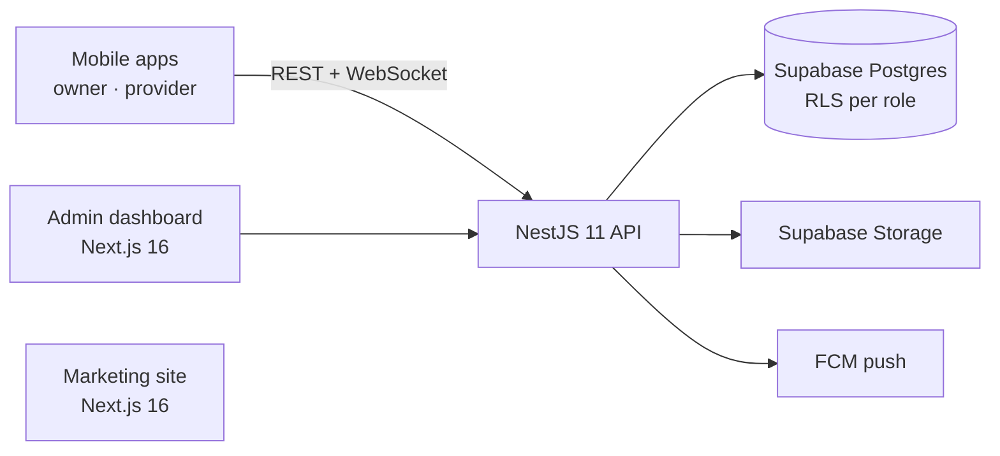

# PetZone

A two-sided marketplace for the Vietnam market where pet owners book stays with verified pet hotels.

This monorepo holds the backend API, the admin dashboard and the marketing site. The owner and provider mobile apps consume the API; its Swagger docs are their contract.

<!-- TODO: screenshots — admin dashboard, Swagger docs, and the mobile booking flow if you can share it. Save in docs/ -->

## Architecture



- **Roles and data isolation:** every table has row-level security with policies for owners, providers and admins. The API runs user requests through RLS-scoped clients and saves the service-role client for admin work. Role guards (`@Roles('provider')`, `@Roles('admin')`) enforce access at the route level.
- **Booking lifecycle:** orders, check-in photos, status reports sent to owners during the stay, and reviews after.
- **Realtime:** owner–hotel chat over a WebSocket gateway, plus FCM push notifications for booking events.
- **Payments:** order payments and provider payouts through a disbursement worker. <!-- TODO: confirm which gateways are live -->
- **Validation:** one set of Zod schemas in `@petzone/validators`, shared by the API and the mobile apps.

## Repo layout

```
apps/
  api/          # NestJS 11 — REST + WebSocket, Swagger at /api/docs   :3001
  web/          # Next.js 16 — marketing site                          :3000
  web-admin/    # Next.js 16 — admin dashboard (TanStack Query)        :3002
packages/
  shared/       # types + constants
  validators/   # Zod schemas (API + mobile)
  supabase/     # typed browser / server / admin clients
  ui/           # shared components (Tailwind + CVA)
  config-typescript/  config-eslint/
supabase/       # 28 migrations, seed, config
```

## Run it

```bash
pnpm install
cp .env.example .env     # Supabase URL/keys, FCM, payment gateway credentials
supabase start           # local Postgres, Auth, Storage, Studio
pnpm db:migrate
pnpm dev                 # all apps via Turborepo
```

API docs: http://localhost:3001/api/docs

## Stack

NestJS · Next.js · TypeScript · PostgreSQL · Supabase (Auth, RLS, Storage) · Zod · TanStack Query · Turborepo · FCM
