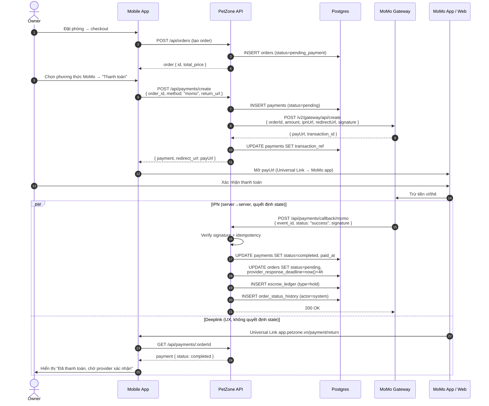
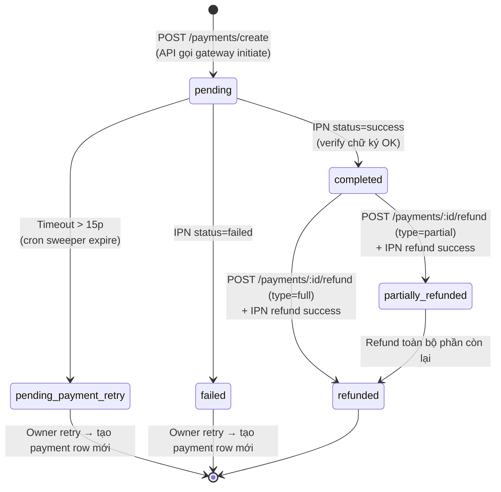
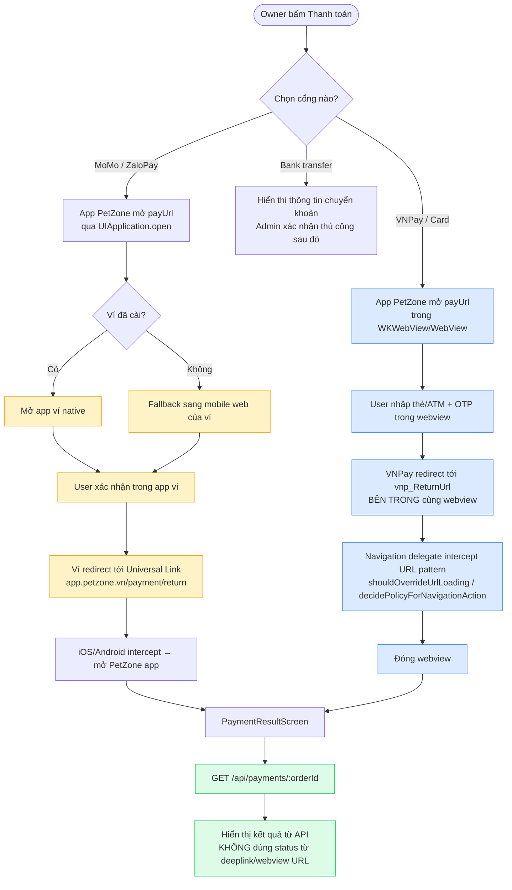

# PetZone Payments v1 — Hướng dẫn tích hợp cổng thanh toán

Đối tượng đọc: kỹ sư backend tích hợp MoMo, ZaloPay, VNPay và thẻ (card) cho luồng
thanh toán v1 (`apps/api/src/modules/payments/`). Thiết kế PSP-aggregated v2 nằm ở
`apps/api/src/modules/payments-v2/`, không thuộc phạm vi tài liệu này.

---

## 1. Hiện trạng v1

| Hạng mục | Tình trạng |
|----------|-----------|
| Phương thức trong DB | `momo`, `zalopay`, `vnpay`, `bank_transfer` (xem `20260407000005_payments.sql`, check constraint trên `payments.method`). **`card` CHƯA có trong enum.** |
| Gọi gateway thật | **Chưa có.** `PaymentsService.create()` insert một row `payments` rồi update ngay sang `completed` (`payments.service.ts:46`). |
| Redirect URL trả về client | `null` (`payments.service.ts:80`). |
| Webhook endpoint | `POST /api/payments/callback/:gateway` có tồn tại nhưng handler chỉ echo một string (`payments.service.ts:83`). Không verify chữ ký, không state machine, không idempotency. |
| Refund | Chỉ ghi DB — không gọi refund tới gateway (`payments.service.ts:113`). |
| Credentials trong `.env.example` | Thiếu: VNPay (`VNPAY_TMN_CODE`, `VNPAY_HASH_SECRET`), MoMo (`MOMO_PARTNER_CODE`, `MOMO_ACCESS_KEY`, `MOMO_SECRET_KEY`). Thiếu hoàn toàn: credentials ZaloPay, return/IPN URLs, base URL của các gateway, cờ bật/tắt sandbox. |

Kết luận: để thực sự thu được tiền, chúng ta cần (a) đăng ký merchant, (b) viết client riêng cho từng gateway, (c) implement xác thực webhook, và (d) bỏ stub auto-complete để chuyển sang luồng redirect thật.

---

## 2. Chuẩn bị từng cổng (nghiệp vụ + hạ tầng)

Mỗi cổng phải onboarding merchant riêng. Phần này không thuộc code — bắt đầu song song với phần engineering vì khâu chậm nhất luôn là verify nghiệp vụ (3–10 ngày làm việc).

### 2.1 Yêu cầu chung cho cả ba ví điện tử

- **Hồ sơ doanh nghiệp**: mã số thuế, giấy phép kinh doanh, tài khoản ngân hàng Việt Nam đứng tên doanh nghiệp.
- **Endpoint HTTPS public**: mỗi cổng yêu cầu đăng ký *Return URL* (trình duyệt quay về sau khi thanh toán) và *IPN/Notify URL* (callback server-to-server). Bắt buộc HTTPS với cert hợp lệ; localhost/ngrok chỉ dùng được trên sandbox.
- **Whitelist IP egress (khuyến nghị)**: một số cổng cho phép whitelist IP để nhận IPN production — pin IP outbound của API server trên dashboard.
- **Lưu trữ idempotency cho webhook**: unique key trên mỗi event để retry an toàn (gateway có thể gửi lại IPN nhiều lần đến khi nhận response `OK`).
- **Đối soát hàng ngày**: kéo settlement report mỗi ngày và đối soát `payments` + `escrow_ledger` với report của gateway.

### 2.2 MoMo

- Đăng ký tại [business.momo.vn](https://business.momo.vn).
- Chọn sản phẩm: **Cổng thanh toán MoMo (AIO)** — thanh toán một lần qua QR + redirect app.
- Credentials cấp: `partnerCode`, `accessKey`, `secretKey`.
- Sandbox: [developers.momo.vn](https://developers.momo.vn) — merchant test riêng, credentials riêng.
- Endpoints:
  - Initiate: `POST https://test-payment.momo.vn/v2/gateway/api/create` (sandbox) / `https://payment.momo.vn/v2/gateway/api/create` (prod). Body JSON, response trả về `payUrl` + `qrCodeUrl`.
  - Refund: `POST /v2/gateway/api/refund`.
  - Query: `POST /v2/gateway/api/query`.
- Chữ ký: HMAC-SHA256 trên chuỗi tham số có thứ tự cố định, secret = `secretKey`. Xem mục 4 để biết thứ tự field chính xác.
- IPN: JSON POST, ký cùng scheme. Phải trả `200` trong vòng 30s, nếu không MoMo sẽ retry.
- Phí: ~1.5–2.5%/giao dịch (thương lượng khi onboarding). Settlement T+1 về tài khoản merchant.
- Settlement: MoMo trả tiền net hằng ngày về tài khoản ngân hàng — **không** giữ escrow phía MoMo. Phần escrow là trách nhiệm của ta (đã có `escrow_ledger`).

### 2.3 ZaloPay

- Đăng ký tại [merchant.zalopay.vn](https://merchant.zalopay.vn).
- Sandbox: [sbgateway.zalopay.vn](https://sbgateway.zalopay.vn).
- Credentials cấp: `app_id`, `key1` (ký request), `key2` (verify callback), `mac_type` (mặc định `HMACSHA256`).
- Endpoints:
  - Initiate: `POST https://sb-openapi.zalopay.vn/v2/create` (sandbox) / `https://openapi.zalopay.vn/v2/create` (prod). Trả về `order_url`.
  - Refund: `POST /v2/refund` (async — trạng thái refund qua callback).
  - Query: `POST /v2/query`.
- Chữ ký: HMAC-SHA256 — request dùng `key1`, callback dùng `key2`. Thứ tự field thay đổi theo từng API (xem docs ZaloPay).
- Phí: ~1.5–2.2%. Settlement T+1.

### 2.4 VNPay

- Đăng ký qua sales VNPay (sandbox tại [sandbox.vnpayment.vn](https://sandbox.vnpayment.vn)).
- Credentials: `vnp_TmnCode`, `vnp_HashSecret`.
- Endpoints:
  - Initiate: redirect user tới `https://sandbox.vnpayment.vn/paymentv2/vpcpay.html?...` (sandbox) / `https://pay.vnpay.vn/vpcpay.html?...` (prod). Tất cả tham số nằm trong query string, ký bằng HMAC-SHA512.
  - Refund / Query: `POST https://sandbox.vnpayment.vn/merchant_webapi/api/transaction` (request type `02` = refund, `08` = query).
- Chữ ký: HMAC-SHA512 trên các tham số `vnp_*` sắp xếp alpha, trừ `vnp_SecureHash`. Hex digest viết thường.
- IPN: GET query string, cùng scheme ký; response phải là `{"RspCode":"00","Message":"success"}`.
- Return URL vs IPN: VNPay gửi *cả hai*. Chỉ tin **IPN** để cập nhật state — Return URL có thể bị user can thiệp.
- **Thẻ quốc tế**: tham số `vnp_BankCode=VISA` / `MASTERCARD` / `JCB` bật luồng chấp nhận thẻ quốc tế qua cùng flow. Đây là cách khuyến nghị cho `card` ở v1 (xem §2.5).
- Phí: ~1.5–1.8% ATM nội địa, ~2.5–3.5% thẻ quốc tế. Settlement T+1 đến T+3.

### 2.5 Thẻ (card)

DB enum hiện chưa có `card`. Có hai hướng:

- **(Khuyến nghị) Đi qua VNPay** với `vnp_BankCode=VISA|MASTERCARD|JCB`. Không cần tích hợp riêng. Chỉ cần thêm `card` vào enum `payments.method` nếu muốn tách flow thẻ với QR/ví.
- **(Nặng hơn) PSP trực tiếp** — Stripe, 2C2P, hoặc OnePAY. Cần scope tuân thủ PCI-DSS SAQ-A (dùng hosted checkout / Stripe Elements iframe — **tuyệt đối không nhận PAN thô trên server chúng ta**). Phát sinh license/compliance; chỉ chọn nếu VNPay từ chối hoặc phí không chấp nhận được.

Phần chuẩn bị cụ thể cho v1: chọn VNPay-với-card-bank-code. Migration cần chạy:

```sql
alter table public.payments drop constraint payments_method_check;
alter table public.payments add constraint payments_method_check
  check (method in ('momo', 'zalopay', 'vnpay', 'card', 'bank_transfer'));
```

Đồng thời cập nhật `packages/shared/src/types/payment.ts:1` (union `PaymentMethod`) và enum `payments.method` trong Swagger DTO tại `apps/api/src/modules/payments/dto.ts:8`.

---

## 3. Phần engineering cần làm trên ứng dụng

Service v1 đang là stub. Để go-live cần:

### 3.1 Thay stub `PaymentsService.create()`

Hiện tại (`payments.service.ts:31-80`):
1. Insert row `payments` với `status=pending`.
2. **Update ngay sang `completed`** — không gọi gateway thật.
3. Move order sang `pending`, ghi `escrow_ledger` hold, ghi history.

Sau khi sửa:
1. Insert row `payments` với `status=pending`, `transaction_ref` = UUID local.
2. Gọi `initiatePayment()` của gateway client → trả về `payment_url` + transaction id của gateway.
3. Persist transaction id của gateway vào `payments.transaction_ref` và `gateway_response`.
4. Trả `{ payment, redirect_url }` về client.
5. **KHÔNG đụng vào order status ở bước này.** Order vẫn ở `pending_payment`. Chỉ chuyển trạng thái khi IPN của gateway xác nhận capture.

### 3.2 Implement webhook handler

`PaymentsController.callback()` (`payments.controller.ts:44-51`) phải:

1. Đọc **raw body** (Nest `@Body()` mặc định parse JSON — đăng ký raw-body middleware cho `/api/payments/callback/*` để verify chữ ký đúng bytes mà gateway đã ký).
2. Lookup adapter theo path param `:gateway`.
3. Verify chữ ký; nếu fail trả về `{ RspCode: '97' }` (hoặc mã lỗi tương ứng từng gateway), không state change.
4. Insert một row `payments_webhook_log` (raw body, headers, signature_valid). Cần tạo bảng này — mirror với `psp_webhook_log` ở v2.
5. Lookup row `payments` theo `transaction_ref`.
6. Idempotency: nếu event id của gateway đã xử lý trước đó, trả success luôn.
7. Khi `status=success`:
   - `payments.status = 'completed'`, `paid_at = now()`.
   - `orders.status = 'pending'`, `provider_response_deadline = now() + 4h` (match logic hiện tại tại `payments.service.ts:54-62`).
   - Insert `escrow_ledger` hold.
   - Insert `order_status_history` row `pending` với `actor_type='system'`.
8. Khi `status=failed`: `payments.status='failed'`, không đụng order. Owner có thể retry từ `pending_payment`.

### 3.3 Implement refund call thật

`PaymentsService.refund()` (`payments.service.ts:113-189`) đang chỉ ghi row `refunds` với `status=processing` và không gọi gateway. Phải thêm bước gọi gateway trước khi insert local và chờ IPN refund để flip về `completed`. Khi chưa có IPN refund, `payments.status` nên là `processing` chứ không phải `refunded`.

### 3.4 Gateway adapter port

Để clean, copy port abstraction từ v2 (`apps/api/src/modules/payments-v2/psp/psp.interface.ts`) sang v1:

```ts
// apps/api/src/modules/payments/gateways/gateway.interface.ts
export interface PaymentGateway {
  readonly name: 'momo' | 'zalopay' | 'vnpay';
  initiate(req: InitiateRequest): Promise<{ redirect_url: string; transaction_ref: string }>;
  refund(req: RefundRequest): Promise<{ gateway_refund_id: string }>;
  verifyWebhookSignature(rawBody: string, headers: Record<string, string>, query: Record<string, string>): boolean;
  parseWebhook(rawBody: string, headers: Record<string, string>, query: Record<string, string>): ParsedEvent;
}
```

Các adapter cụ thể: `MomoGateway`, `ZalopayGateway`, `VnpayGateway`. Service resolve qua một injection map theo `payments.method`. `bank_transfer` giữ flow thủ công (admin xác nhận trên dashboard).

### 3.5 Env vars cần thêm vào `.env.example`

```env
# v1 payment gateways
PAYMENTS_V1_RETURN_URL=https://app.petzone.vn/orders/{orderId}/payment-result
PAYMENTS_V1_IPN_BASE_URL=https://api.petzone.vn

# MoMo
MOMO_ENABLED=false
MOMO_ENDPOINT=https://test-payment.momo.vn
MOMO_PARTNER_CODE=
MOMO_ACCESS_KEY=
MOMO_SECRET_KEY=

# ZaloPay
ZALOPAY_ENABLED=false
ZALOPAY_ENDPOINT=https://sb-openapi.zalopay.vn
ZALOPAY_APP_ID=
ZALOPAY_KEY1=
ZALOPAY_KEY2=

# VNPay
VNPAY_ENABLED=false
VNPAY_ENDPOINT=https://sandbox.vnpayment.vn/paymentv2/vpcpay.html
VNPAY_API_ENDPOINT=https://sandbox.vnpayment.vn/merchant_webapi/api/transaction
VNPAY_TMN_CODE=
VNPAY_HASH_SECRET=
```

Lên prod thì đổi từng `ENDPOINT` sang URL production và set `*_ENABLED=true`.

### 3.6 Webhook URL cần đăng ký trên dashboard từng cổng

| Cổng | Path |
|------|------|
| MoMo | `POST {API_BASE}/api/payments/callback/momo` |
| ZaloPay | `POST {API_BASE}/api/payments/callback/zalopay` |
| VNPay IPN | `GET {API_BASE}/api/payments/callback/vnpay` |
| VNPay Return | `GET {WEB_BASE}/orders/{orderId}/payment-result` (chỉ browser — không transition state) |

IPN VNPay là GET (query string) chứ không phải POST — handler phải accept GET hoặc tách route riêng.

---

## 4. Tham khảo chữ ký (rút gọn)

### MoMo (request)

```
hmac_sha256(secretKey,
  "accessKey=" + accessKey +
  "&amount=" + amount +
  "&extraData=" + extraData +
  "&ipnUrl=" + ipnUrl +
  "&orderId=" + orderId +
  "&orderInfo=" + orderInfo +
  "&partnerCode=" + partnerCode +
  "&redirectUrl=" + redirectUrl +
  "&requestId=" + requestId +
  "&requestType=" + requestType)
```

Chữ ký webhook: cùng scheme với thứ tự field theo payload — xem [MoMo IPN docs](https://developers.momo.vn).

### ZaloPay (request)

```
hmac_sha256(key1, app_id + "|" + app_trans_id + "|" + app_user + "|" + amount + "|" + app_time + "|" + embed_data + "|" + item)
```

Verify callback dùng `key2` trên field `data`.

### VNPay (request + IPN)

1. Filter các param có prefix `vnp_`, bỏ `vnp_SecureHash`.
2. Sort key tăng dần.
3. URL-encode value, nối thành `key=value` qua `&`.
4. `hmac_sha512(HashSecret, signedString)` → hex viết thường.
5. Append vào redirect URL dưới dạng `&vnp_SecureHash=<hex>`.

---

## 5. Sơ đồ tích hợp

### 5.1 Sequence happy path (ví dụ MoMo)



Sơ đồ trên minh họa MoMo. ZaloPay giống hệt. VNPay khác ở bước 9: thay vì mở app ví, app PetZone mở `payUrl` trong **in-app webview** và intercept return URL ở bước 19 thay vì để Universal Link bắt.

### 5.2 State machine `payments.status`



`orders.status` chạy song song:

```
pending_payment ──(payments IPN success)──→ pending
                                              ↓ (provider accept)
                                            confirmed → checked_in → in_progress → check_out → completed
                                              ↓ (provider decline / owner cancel)
                                            cancelled (+ refund nếu đã capture)
```

### 5.3 Khác biệt theo cổng



### 5.4 Sơ đồ kiến trúc các thành phần

```
┌────────────────┐         ┌─────────────────────────┐
│  Mobile App    │         │   Web (app.petzone.vn)  │
│  (iOS/Android) │         │   - AASA + assetlinks   │
│                │         │   - /payment/return page│
└───────┬────────┘         └─────────────────────────┘
        │
        │ HTTPS
        ▼
┌────────────────────────────────────────────────────────┐
│  PetZone API (apps/api)                                │
│  ┌──────────────────────────────────────────────────┐  │
│  │  PaymentsController                              │  │
│  │  ├─ POST /payments/create   (auth)               │  │
│  │  ├─ POST /payments/callback/:gateway  (public)   │  │
│  │  └─ POST /payments/:id/refund   (auth)           │  │
│  └────────────────────────┬─────────────────────────┘  │
│                           │                            │
│  ┌────────────────────────▼─────────────────────────┐  │
│  │  PaymentsService                                 │  │
│  │  ├─ resolves gateway adapter theo method         │  │
│  │  ├─ idempotency check                            │  │
│  │  └─ writes to: payments, orders, escrow_ledger,  │  │
│  │     order_status_history, payments_webhook_log   │  │
│  └────────────────────────┬─────────────────────────┘  │
│                           │                            │
│  ┌────────────────────────▼─────────────────────────┐  │
│  │  PaymentGateway port (interface)                 │  │
│  │  ├─ MomoGateway                                  │  │
│  │  ├─ ZalopayGateway                               │  │
│  │  ├─ VnpayGateway       (xử lý cả thẻ)            │  │
│  │  └─ MockGateway        (test/dev)                │  │
│  └─────┬──────────────┬──────────────┬──────────────┘  │
│        │              │              │                 │
│  ┌─────▼─────┐  ┌─────▼─────┐  ┌─────▼─────┐           │
│  │ PaymentTime│ │ Webhook   │  │ Refund    │           │
│  │ outSweeper │ │ Logger    │  │ Worker    │           │
│  │ (cron 1p)  │ │           │  │           │           │
│  └────────────┘ └───────────┘  └───────────┘           │
└────────────────────────────────────────────────────────┘
        │             ▲                  ▲
        │             │ IPN              │ Disbursement (tương lai)
        ▼             │                  │
┌──────────────────────────────────┐  ┌──────────────────┐
│  Payment Gateways                │  │  Bank / PSP      │
│  ┌─────────┐ ┌─────────┐ ┌─────┐ │  │  (9Pay disburse  │
│  │  MoMo   │ │ ZaloPay │ │VNPay│ │  │   hoặc manual    │
│  └─────────┘ └─────────┘ └─────┘ │  │   transfer cho   │
└──────────────────────────────────┘  │   provider)      │
                │                     └──────────────────┘
                │ T+1 settlement
                ▼
┌──────────────────────────────────────────────┐
│  Tài khoản ngân hàng PetZone JSC             │
│  (tiền vật chất nằm ở đây, escrow là logic)  │
└──────────────────────────────────────────────┘
```

### 5.5 State machine order/payment kết hợp (rút gọn)

```
[create order]
   ↓
pending_payment ──(POST /payments/create)──→ pending_payment (kèm redirect_url)
   │                                                  ↓
   │                                          [user thanh toán tại gateway]
   │                                                  ↓
   │                                          [IPN gateway → /callback/:gateway]
   │                                                  ↓
   │            success ─────────────────────→ pending (+ escrow hold)
   │            failed ──────────────────────→ pending_payment (cho retry)
   │            timeout (không IPN trong 15p) → pending_payment (cron quét)
```

Cần thêm một sweeper tương tự `OrderAutoCompleteWorker` (`apps/api/src/modules/orders/order-auto-complete.worker.ts`) để expire các `payments` mắc kẹt ở `pending` quá session window của gateway (MoMo 15p, ZaloPay 15p, VNPay 15p).

---

## 6. Checklist kiểm thử

Trước khi bật `*_ENABLED=true` trên production:

- [ ] Happy path sandbox: mỗi cổng MoMo, ZaloPay, VNPay đều sinh redirect được, IPN flip order sang `pending`, ghi `escrow_ledger`.
- [ ] Sai chữ ký: tamper 1 byte body IPN → handler trả mã lỗi, không state change.
- [ ] Idempotency: replay cùng IPN 3 lần → state không đổi sau lần đầu.
- [ ] Roundtrip refund: full + partial refund cho từng cổng → IPN refund settle `payments.status`.
- [ ] Concurrent: hai IPN delivery song song cho cùng `transaction_ref` → chỉ có một transition (dùng guard `WHERE status='pending'` trên update).
- [ ] Thẻ qua VNPay (`vnp_BankCode=VISA`): redirect + IPN hoạt động giống ATM.
- [ ] Timeout: không có IPN trong 20 phút → order vẫn ở `pending_payment`, owner retry được.
- [ ] Đối soát: kéo settlement report hằng ngày của từng cổng, đối chiếu từng row với rows trong `payments` ngày tương ứng.

---

## 7. Thứ tự rollout đề xuất

1. **Migration**: thêm `card` vào enum, tạo bảng `payments_webhook_log`, thêm unique index `gateway_event_id` cho idempotency.
2. **Gateway port**: implement interface `PaymentGateway` + `MockGateway` cho test.
3. **VNPay trước** (xử lý cả thẻ và ATM trong một tích hợp → con đường ngắn nhất để thu tiền thật).
4. **MoMo tiếp theo** (thị phần ví lớn nhất ở VN consumer).
5. **ZaloPay cuối cùng**.
6. **Card trực tiếp** (Stripe/2C2P): chỉ làm nếu VNPay từ chối card route.

`bank_transfer` giữ nguyên flow thủ công admin xác nhận — không cần tích hợp gateway.

---

## 8. Deeplink trên mobile app (team app phụ trách)

Checkout của mỗi cổng hoặc (a) hand-off sang app ví của cổng đó (MoMo, ZaloPay) hoặc (b) chạy trong webview (VNPay ATM/QR, card). Trong cả hai trường hợp, user phải quay được về app PetZone sau khi thanh toán. Đó là phần deeplink — API không thể xử lý hộ team app.

**Tách biệt trách nhiệm quan trọng:** IPN (server→server) là thứ flip `payments.status` và `orders.status`. Deeplink **chỉ phục vụ UX** — đưa user về app. Tuyệt đối không trust payload từ deeplink để cập nhật state; luôn re-fetch `GET /api/payments/:orderId` sau khi quay về.

### 8.1 Những thứ team app cần chuẩn bị

| Hạng mục | iOS | Android |
|----------|-----|---------|
| Universal / App Link | Associated Domains entitlement: `applinks:app.petzone.vn` | Intent filter trên `https://app.petzone.vn/payment/return` với `android:autoVerify="true"` |
| File verify hosted | `https://app.petzone.vn/.well-known/apple-app-site-association` (JSON, không có `.json` extension, Content-Type `application/json`, không redirect) | `https://app.petzone.vn/.well-known/assetlinks.json` |
| URI scheme tự định (fallback) | `petzone://payment/return` | `petzone://payment/return` |
| In-app webview | `WKWebView` với `decidePolicyForNavigationAction` để intercept | `WebView` với `shouldOverrideUrlLoading` |

Universal/App Link là **bắt buộc** — chỉ dùng custom scheme không đủ tin cậy vì một số webview OTP của ngân hàng và browser Android sẽ strip redirect non-HTTPS. Custom scheme chỉ giữ làm fallback.

Hai file hosted (`apple-app-site-association`, `assetlinks.json`) nằm trên domain do **team web** quản lý (`apps/web` hoặc bất cứ đâu serve `app.petzone.vn`). Hand JSON cho người đang phụ trách deploy domain đó.

### 8.2 Format return URL bắt buộc

URL duy nhất API gửi cho mọi gateway dưới dạng `redirectUrl` / `vnp_ReturnUrl`:

```
https://app.petzone.vn/payment/return?order_id={orderId}&payment_id={paymentId}
```

Cài qua env `PAYMENTS_V1_RETURN_URL` (xem §3.5). Trang tại URL này phải:

1. Là một trang web thật (gateway sẽ reject URL non-HTTPS hoặc non-2xx khi onboarding merchant).
2. Khi mở, cố deeplink vào app: `window.location = "petzone://payment/return?order_id=...&status=..."`.
3. Nếu universal link đã đăng ký đúng, iOS/Android sẽ intercept URL HTTPS **trước khi** browser mở — bước 2 không bao giờ chạy, app nhận deeplink luôn.
4. Nếu không resolve được (user đang trên desktop hoặc đã gỡ app), hiển thị trang fallback "Đã nhận thanh toán — mở app để tiếp tục".

### 8.3 Luồng từng cổng trên mobile

**MoMo:**

1. App gọi `POST /api/payments/create` → nhận `redirect_url` (`payUrl` của MoMo).
2. App mở `payUrl` qua `UIApplication.open(_:)` / `Intent.ACTION_VIEW`. iOS/Android sẽ mở app MoMo nếu có cài; nếu không thì mở browser.
3. User thanh toán trong app MoMo.
4. App MoMo gọi callback về URL đã đăng ký → universal link của ta `https://app.petzone.vn/payment/return?...`.
5. iOS/Android mở lại app PetZone; app route sang màn hình kết quả và re-fetch state order/payment từ API.

**ZaloPay:** giống hệt MoMo. `order_url` mở app ZaloPay → ZaloPay redirect về universal link của ta.

**VNPay (ATM, QR, card):**

1. App gọi `POST /api/payments/create` → nhận `redirect_url` (VNPay `vpcpay.html`).
2. App mở URL **trong in-app webview** (không phải browser hệ thống — bước OTP của VNPay phụ thuộc cookies không nên rò sang Safari/Chrome).
3. User nhập thẻ / thông tin ngân hàng trong webview.
4. VNPay redirect về `vnp_ReturnUrl` (= universal link của ta) trong cùng webview đó.
5. Navigation delegate của webview intercept pattern URL này và đóng webview — **không** load trang.
6. App re-fetch state order/payment từ API.

**Bank transfer:** không cần deeplink — owner chuyển khoản thủ công, admin xác nhận trên dashboard.

### 8.4 Checklist bàn giao cho team app

- [ ] Đăng ký `applinks:app.petzone.vn` trong entitlements iOS.
- [ ] Thêm intent filter HTTPS với `autoVerify=true` trong Android `AndroidManifest.xml`.
- [ ] Implement `PaymentResultScreen` nhận `order_id` + `payment_id` và re-fetch state — không hiển thị `status` từ gateway trực tiếp.
- [ ] Xử lý in-app webview cho VNPay: intercept pattern URL `app.petzone.vn/payment/return`, dismiss webview, route sang màn hình kết quả.
- [ ] Implement fallback custom scheme (`petzone://payment/return`) cho trường hợp verify universal link fail.
- [ ] Phối hợp với team web để host file AASA + assetlinks (team web quản lý `app.petzone.vn`).
- [ ] Test trên iOS Safari → app MoMo → quay về app PetZone (cold start + warm start).
- [ ] Test trên Android Chrome → app ZaloPay → quay về app PetZone.
- [ ] Test trên iOS khi app MoMo không cài (phải fallback sang mobile web của MoMo).
- [ ] Test airplane-mode-sau-khi-trả-tiền: user thanh toán, tắt mạng, quay về app — re-fetch phải retry và không crash.

---

## 9. Câu hỏi mở cho product/business

- [ ] Pháp nhân nào đứng tài khoản merchant — PetZone JSC hay công ty con vận hành? (Quyết định hồ sơ KYC.)
- [ ] Thẻ nào cần hỗ trợ: chỉ Visa + MasterCard, hay cả JCB / Amex?
- [ ] Có cần flow trả góp (installment) không? Cả VNPay và MoMo đều hỗ trợ nhưng phát sinh thêm param khi redirect.
- [ ] SLA refund cam kết với owner: instant (gateway-side) hay T+N (đối soát thủ công)?
- [ ] Provider có thấy transaction ref của gateway không, hay chỉ thấy `order_number` nội bộ?
